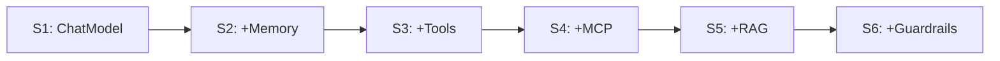

# Build an AI Shopping Assistant with ColdFusion 2025

> CFSummit 2026 Workshop — 6 sessions × 60 minutes — Hands-on

 

**[S1](#s1)** | **[S2](#s2)** | **[S3](#s3)** | **[S4](#s4)** | **[S5](#s5)** | **[S6](#s6)** | [Quick Start](#quick-start) | [Stuck?](#stuck)

## Quick Start

Your AMI is pre-built. Nothing to install. Verify in 2 minutes:

1. Open browser → [`http://localhost:8500/CFSummit2026Workshop/StyleMart/setup/setup.cfm`](StyleMart/setup/setup.cfm) — you should see 5 `[ok]` lines and "Setup complete." This registers databases and REST services.
2. Navigate to `http://localhost:8500/CFSummit2026Workshop/StyleMart/`
3. Click the chat icon (bottom-right) → chat panel opens
4. Toggle mode to **Ref** → type "hi" → send → streaming response appears
5. Open trace panel (right side) → verify events: `model.start`, `model.delta`, `model.end`, `done`
6. Toggle back to **Lab** → type "hi" → send → timeout or error (expected — you haven't coded it yet!)

✅ If step 4 streams tokens, you're ready. Open your [Session 1 Guide](StyleMart/api/agent/s1/lab/GUIDE.md) and start coding.

> [!TIP]
> **New to ColdFusion AI?** Open a scratchpad first — zero setup, instant results:
> - [S1 Scratchpad](StyleMart/api/agent/s1/lab/scratchpad.cfm) — make your first AI call in 3 lines
> - [S2 Scratchpad](StyleMart/api/agent/s2/lab/scratchpad.cfm) — see memory and preference extraction live

❌ If step 3 fails, raise your hand. Do not debug infrastructure — the instructor will help.

> **The workflow for every session:** Edit lab file → save → send chat message → see result. No restart needed.

## Sessions

| # | Session | What You Add to Mira | Files You Edit | Guide | Explore First |
|---|---------|---------------------|----------------|-------|---------------|
| <a id="s1"></a>1 | Hello, ChatModel | Stream real LLM tokens via SSE | [`s1/lab/AgentService.cfc`](StyleMart/api/agent/s1/lab/AgentService.cfc), [`ChatService.cfc`](StyleMart/api/agent/s1/lab/ChatService.cfc) | [Guide](StyleMart/api/agent/s1/lab/GUIDE.md) | [Scratchpad](StyleMart/api/agent/s1/lab/scratchpad.cfm) |
| <a id="s2"></a>2 | Memory & Preferences | Multi-turn coherence + preference extraction | [`s2/lab/AgentService.cfc`](StyleMart/api/agent/s2/lab/AgentService.cfc), [`ChatService.cfc`](StyleMart/api/agent/s2/lab/ChatService.cfc), [`Memory.cfc`](StyleMart/api/agent/s2/lab/Memory.cfc) | [Guide](StyleMart/api/agent/s2/lab/GUIDE.md) | [Scratchpad](StyleMart/api/agent/s2/lab/scratchpad.cfm) |
| <a id="s3"></a>3 | CFC Tools | Wire 7 e-commerce tools (search, cart, orders) | [`s3/lab/AgentService.cfc`](StyleMart/api/agent/s3/lab/AgentService.cfc) | [Guide](StyleMart/api/agent/s3/lab/GUIDE.md) | — |
| <a id="s4"></a>4 | MCP | Live weather + logistics via external services | [`s4/lab/AgentService.cfc`](StyleMart/api/agent/s4/lab/AgentService.cfc) | [Guide](StyleMart/api/agent/s4/lab/GUIDE.md) | — |
| <a id="s5"></a>5 | RAG | Ground answers in catalog, policy, and reviews | [`s5/lab/AgentService.cfc`](StyleMart/api/agent/s5/lab/AgentService.cfc), [`init-rag.cfm`](StyleMart/api/agent/s5/lab/init-rag.cfm) | [Guide](StyleMart/api/agent/s5/lab/GUIDE.md) | — |
| <a id="s6"></a>6 | Guardrails | Block hallucinations + enforce safety rules | [`s6/lab/AgentService.cfc`](StyleMart/api/agent/s6/lab/AgentService.cfc), [guardrails/](StyleMart/api/agent/s6/lab/guardrails/) | [Guide](StyleMart/api/agent/s6/lab/GUIDE.md) | — |



> After Session 6, Mira streams AI responses, remembers your preferences, searches products, checks live weather, cites store policies, and blocks unsafe responses — a production-ready AI agent in pure CFML.

## <a id="stuck"></a> Joining Late? Stuck? Fell Behind?

> [!TIP]
> **Toggle to Ref mode** in the chat panel header. The reference implementation always works. Compare it with your lab code to find the issue.

**Missed earlier sessions?** Each session's lab/ folder starts clean. Toggle Ref mode to verify things work, then follow your current session's guide from Step 1. Previous sessions don't need to be completed — Ref mode covers them.

**Something broke?** Check the [Fast-Track Rescue Guide](docs/workshop/fast-track-rescue.md) for copy-paste catch-up blocks.

**Need human help?** Raise your hand. The instructor and TAs are here for exactly this.

## Where Things Live

```
StyleMart/api/agent/s1..s6/     <- Your workspace (one folder per session)
    config/                     <- AI settings, system prompts (edit during experiments)
    lab/                        <- YOUR code - fill the TODOs here
    ref/                        <- Working reference - read-only, always functional
```

| What | Where |
|------|-------|
| Session guides (inside each lab/) | [`s1/lab/GUIDE.md`](StyleMart/api/agent/s1/lab/GUIDE.md) ... [`s6/lab/GUIDE.md`](StyleMart/api/agent/s6/lab/GUIDE.md) |
| Cheat sheet (function signatures, config shapes) | [`docs/workshop/cheat-sheet.md`](docs/workshop/cheat-sheet.md) |
| Full workshop walkthrough | [`Draft-L2/workshop-walkthrough.md`](Draft-L2/workshop-walkthrough.md) |
| Product data and database | [`StyleMart/db/`](StyleMart/db/) |
| MCP external services | [`externalservices/`](externalservices/) |

## Resources

- [Cheat Sheet](docs/workshop/cheat-sheet.md) — CF2025 AI function signatures, config shapes, SSE event types
- [Fast-Track Rescue](docs/workshop/fast-track-rescue.md) — Copy-paste catch-up blocks per session
- [Post-Workshop Guide](docs/workshop/post-workshop-resources.md) — Deploy to production, swap providers, community links
- [ColdFusion 2025 AI Documentation](https://helpx.adobe.com/coldfusion/using/ai-functions.html)

<details>
<summary>Glossary</summary>

| Term | Meaning |
|------|---------|
| SSE | Server-Sent Events — one-way streaming from server to browser |
| MCP | Model Context Protocol — standard for connecting AI to external tools |
| RAG | Retrieval-Augmented Generation — grounding AI responses in real documents |
| Guardrails | Validators that block unsafe AI responses before they reach the user |
| ChatModel() | CF2025 built-in function to connect to any LLM provider |
| agent() | CF2025 built-in function that wraps a model with memory, tools, RAG, and streaming |

</details>
